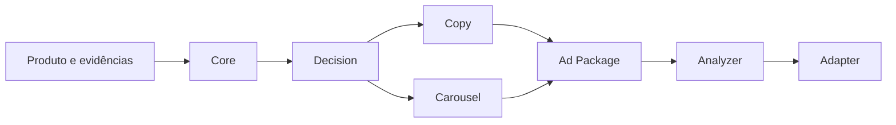

# DROP-IN MARKETPLACE OS

Framework profissional para geração, análise e evolução de anúncios de marketplaces por meio de arquitetura modular, contratos versionados e automação responsável.

> **Status:** Canonical Contracts · **Versão:** `0.2.0` · **Estabilidade:** desenvolvimento inicial

## Visão

O DROP-IN MARKETPLACE OS transforma dados e evidências de um produto em um pacote de anúncio consistente: estratégia, copy, plano visual, análise de qualidade e adaptação ao canal. O objetivo não é apenas gerar conteúdo, mas tornar todo o processo explicável, auditável, reutilizável e seguro para escalar.

## Problema que resolvemos

Operações de marketplace frequentemente mantêm regras em conversas, planilhas, prompts isolados e conhecimento individual. Isso causa anúncios inconsistentes, perda de aprendizado, retrabalho, alegações sem evidência e dificuldade para integrar pessoas, IA e sistemas.

Este repositório centraliza o conhecimento oficial e define como cada capacidade deve evoluir sem quebrar as demais.

## Princípios

1. **Verdade antes de persuasão:** fatos do produto não podem ser inventados.
2. **Contratos antes da implementação:** interfaces são explícitas e validadas.
3. **Modularidade:** decisão, copy, criativos, análise e canais têm fronteiras próprias.
4. **Explicabilidade:** scores e recomendações apontam critérios e evidências.
5. **Compatibilidade:** mudanças seguem SemVer, depreciação e migração.
6. **Human-in-the-loop:** riscos, ambiguidades e baixa confiança exigem revisão.
7. **Repositório como fonte oficial:** uma regra só é oficial quando versionada aqui.

## Arquitetura conceitual



As engines ainda não são implementadas no Commit 0001. Esta versão estabelece somente a fundação necessária para desenvolvê-las com contratos e responsabilidades claras.

## Documentação oficial

| Documento | Finalidade |
|---|---|
| [Manifesto](MANIFEST.md) | Valores, compromissos e definição de qualidade. |
| [Contexto do projeto](docs/project/PROJECT_CONTEXT.md) | Problema, visão, usuários, escopo e métricas. |
| [Arquitetura](docs/project/ARCHITECTURE.md) | Camadas, módulos, fluxo e requisitos não funcionais. |
| [Guia de desenvolvimento](docs/project/DEVELOPMENT_GUIDE.md) | Processo, commits, testes, review e DoD. |
| [Regras para IA](docs/project/AI_RULES.md) | Segurança, autoridade e comportamento de agentes. |
| [Versionamento](docs/project/VERSIONING.md) | SemVer, compatibilidade, depreciação e releases. |
| [Contratos canônicos](docs/contracts/README.md) | Modelo de dados, validação e evolução dos contratos. |
| [Modelo canônico](docs/contracts/CANONICAL_MODEL.md) | Semântica de produto, oferta, evidências e claims. |
| [Taxonomia de erros](docs/contracts/ERROR_TAXONOMY.md) | Estados, severidades e códigos estáveis. |
| [Roadmap](ROADMAP.md) | Fases, entregas e critérios de saída. |
| [Versão](VERSION.md) | Estado canônico da versão atual. |
| [Changelog](CHANGELOG.md) | Histórico das mudanças relevantes. |

## Estrutura da Foundation

```text
.
├── README.md
├── MANIFEST.md
├── ROADMAP.md
├── VERSION.md
├── CHANGELOG.md
└── docs/
    └── project/
        ├── PROJECT_CONTEXT.md
        ├── ARCHITECTURE.md
        ├── DEVELOPMENT_GUIDE.md
        ├── AI_RULES.md
        └── VERSIONING.md
```

Pastas de código, engines, adapters, schemas e testes serão criadas nos commits que introduzirem conteúdo funcional. O projeto não usa pastas vazias ou placeholders superficiais.

## Governança de mudanças

- cada commit representa uma intenção lógica completa;
- mudanças estruturais relevantes exigem ADR;
- nenhuma mudança pública ignora avaliação de compatibilidade;
- documentação e implementação evoluem juntas;
- dados sensíveis e credenciais nunca são versionados;
- conclusão exige validação proporcional ao risco.

## Validação dos contratos

```bash
npm ci
npm test
```

O teste compila o JSON Schema Draft 2020-12, valida fixtures positivas e confirma que exemplos negativos falham pelo código esperado.

## Estado atual e próximo marco

A versão `0.2.0` conclui **Canonical Contracts**: produto, oferta, evidências, claims, assets e metadados possuem contrato versionado e validação estrutural/semântica. O próximo marco previsto é a **Decision Engine**, que deverá consumir esse contrato sem alterar fatos.

## Licença

Distribuído sob a [MIT License](LICENSE).