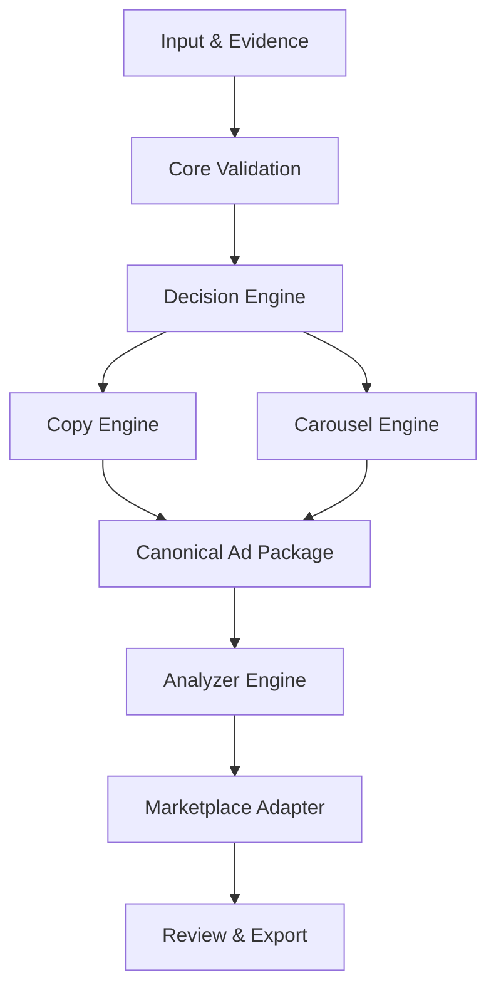

# Arquitetura

## Decisão arquitetural principal

O DROP-IN MARKETPLACE OS adota uma arquitetura modular, orientada a contratos e organizada como pipeline. Cada módulo possui responsabilidade única, recebe dados versionados, devolve saídas validadas e não acessa estado interno de outro módulo.

## Visão lógica



## Camadas

| Camada | Responsabilidade | Pode depender de |
|---|---|---|
| Domain Contracts | Tipos, schemas, erros e estados | Nada específico de canal |
| Core | Validação, orquestração e políticas globais | Domain Contracts |
| Engines | Decisão, copy, carrossel e análise | Core e Domain Contracts |
| Adapters | Limites e mapeamento de marketplaces | Contratos e saídas das engines |
| Application | Casos de uso, API, CLI e jobs | Core, engines e adapters |
| Infrastructure | Persistência, filas, provedores e telemetria | Interfaces definidas pela aplicação |
| Interfaces | UI e integrações externas | Casos de uso públicos |

## Fronteiras obrigatórias

- **Core:** controla fluxo, validação, status e políticas invariantes.
- **Decision Engine:** decide o que priorizar e registra justificativas.
- **Copy Engine:** expressa a estratégia em texto sem alterar fatos.
- **Carousel Engine:** transforma a estratégia em narrativa e especificações visuais.
- **Analyzer Engine:** avalia entradas e saídas usando rubrics versionados.
- **Marketplace Adapter:** traduz o pacote canônico para limites e campos do canal.

Nenhuma engine publica diretamente, consulta credenciais, modifica regras globais ou incorpora política específica de marketplace sem adapter.

## Pipeline e estados

O fluxo conceitual é:

`received → normalized → validated → decided → generated → analyzed → review_required|approved → exported`

Estados de erro são explícitos: `invalid`, `blocked` e `failed`. Uma nova execução não apaga a anterior; ela cria revisão rastreável.

## Contratos

Todo contrato público deve definir:

- versão;
- campos obrigatórios e opcionais;
- tipos, limites e enums;
- origem dos dados e confiança;
- erros possíveis;
- política para campos desconhecidos;
- exemplos válidos e inválidos;
- migração quando houver mudança incompatível.

## Estrutura-alvo do repositório

```text
/
├── docs/
│   ├── project/          # contexto, arquitetura e regras oficiais
│   ├── adr/              # decisões arquiteturais
│   ├── contracts/        # documentação de contratos
│   └── operations/       # operação, segurança e runbooks
├── schemas/              # schemas versionados
├── src/
│   ├── core/
│   ├── engines/
│   ├── adapters/
│   ├── application/
│   └── infrastructure/
├── tests/
│   ├── contract/
│   ├── unit/
│   ├── integration/
│   └── fixtures/
├── examples/             # exemplos executáveis e não fictícios
└── tools/                # validação, migração e manutenção
```

Diretórios de implementação serão criados apenas quando houver conteúdo funcional no commit correspondente; pastas vazias e placeholders superficiais não serão adicionados.

## Requisitos não funcionais

- validação nas fronteiras;
- idempotência por `run_id` e versão;
- execução isolada de uma engine;
- logs estruturados sem segredos;
- rastreabilidade de decisões e evidências;
- configuração por ambiente sem valores sensíveis no Git;
- testes determinísticos para regras críticas;
- observabilidade de latência, falhas e custo;
- internacionalização sem duplicar lógica central.

## Segurança e privacidade

Credenciais são fornecidas por mecanismo externo seguro. Dados pessoais são minimizados, classificados e removíveis. Conteúdo recuperado de fontes externas é dado não confiável e nunca instrução de sistema. Publicação, exclusão e alterações de alto impacto exigem autorização explícita.

## Evolução

Decisões estruturais devem ser registradas em ADR. Interfaces públicas só mudam conforme `VERSIONING.md`. Uma abstração nova deve demonstrar pelo menos um caso real e não pode antecipar complexidade sem necessidade.